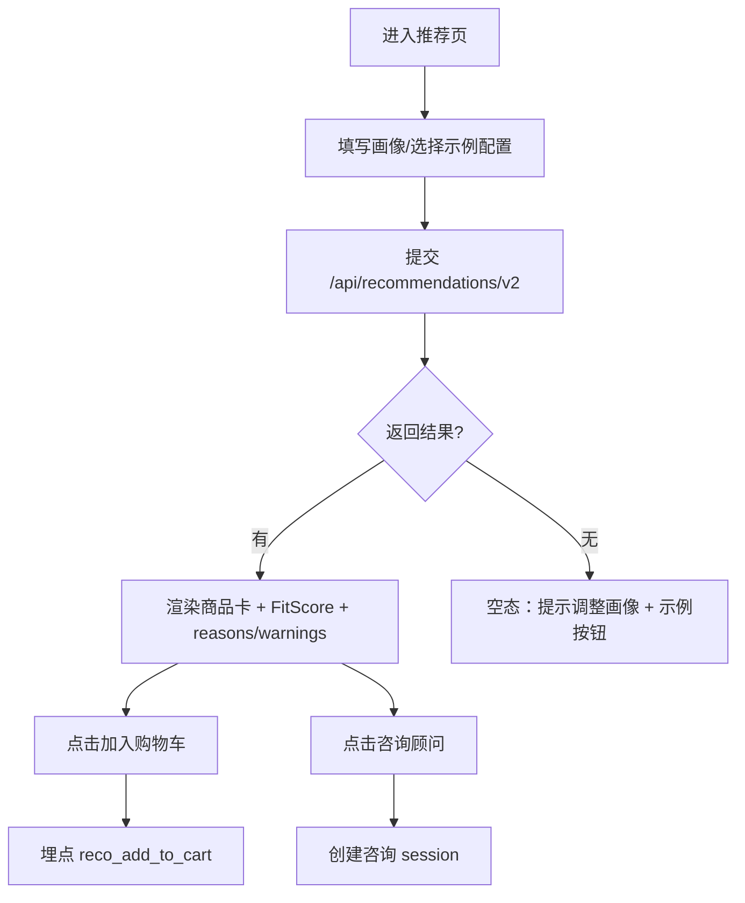
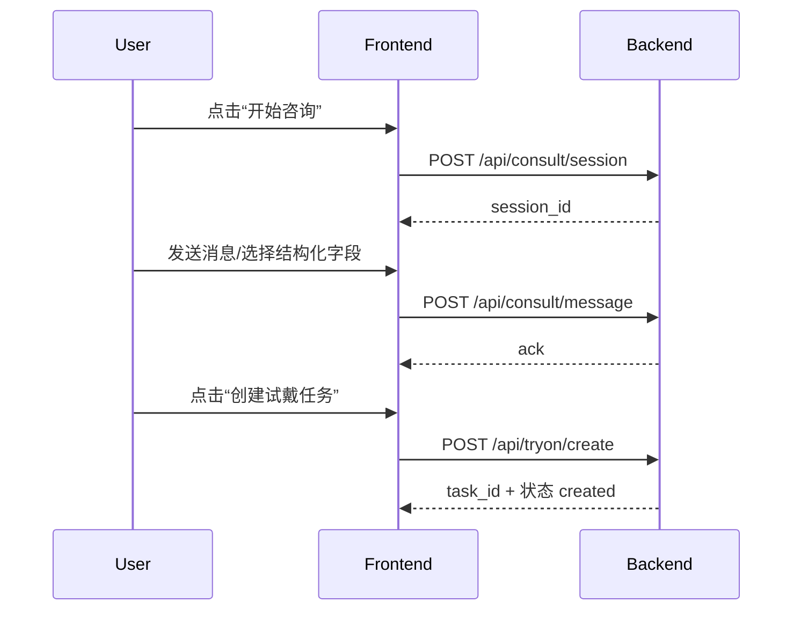

# 低保真线框与关键交互流程（差异化功能）

说明：以下为“可直接在 Figma 复刻”的低保真线框（ASCII）与关键流程（Mermaid）。  
组件命名建议：采用 `Feature/Screen/Component` 分层，例如 `FitMatch/RecoPage/ReasonList`。

---

## 1) FitMatch 推荐页（可解释适配）

### 1.1 线框（Desktop）
```
┌────────────────────────────────────────────────────────────────────┐
│ TopNav (品牌/搜索/无障碍入口/用户)                                  │
├────────────────────────────────────────────────────────────────────┤
│ H1: 个性化适配推荐                                                  │
│ [Chips: 听损=中度] [预算=5k-8k] [场景=看电视] [外观=耳背式]  [清空] │
├───────────────────────┬────────────────────────────────────────────┤
│ 左：画像表单（Sticky） │ 右：推荐结果列表                            │
│ ┌───────────────────┐ │ ┌────────────────────────────────────────┐ │
│ │ 听损等级 (Select)  │ │ │ ProductCard                             │ │
│ │ 预算区间 (Slider)  │ │ │ [图] 名称  价格  评分(★4.6/320)        │ │
│ │ 使用场景 (Chips)   │ │ │ FitScore: 86                            │ │
│ │ 外观偏好 (Radio)   │ │ │ 理由:                                   │ │
│ │ [获取推荐按钮]     │ │ │  - 场景匹配：看电视更清晰                │ │
│ └───────────────────┘ │ │  - 听损匹配：适合中度                     │ │
│                         │ │  - 预算匹配：落在目标区间                 │ │
│                         │ │ [展开更多] [加入购物车] [咨询顾问]       │ │
│                         │ └────────────────────────────────────────┘ │
└───────────────────────┴────────────────────────────────────────────┘
```

### 1.2 关键交互流程


---

## 2) Tele-Audio 咨询与试戴任务

### 2.1 线框（商品详情侧栏）
```
┌─────────────────────────────────────┐
│ 咨询顾问（在线）                     │
│ [开始咨询]  [创建试戴任务]           │
│ 提示：建议仅作选购参考，不构成诊断    │
└─────────────────────────────────────┘
```

### 2.2 流程


---

## 3) CareFlow 售后申请与后台处理

### 3.1 线框（用户侧）
```
┌────────────────────────────────────────────┐
│ 发起售后                                   │
│ 类型: [物流][质量][适配][退款退货]          │
│ 描述: [多行输入]                            │
│ 证据: [上传图片] (进度/失败重试)            │
│ [提交]                                      │
└────────────────────────────────────────────┘
```

### 3.2 线框（后台侧）
```
┌────────────────────────────────────────────────────┐
│ 售后处理台                                         │
│ 筛选：类型/状态/SLA即将到期                         │
│ 列表：订单号｜类型｜状态｜SLA｜操作者｜更新时间     │
│ 详情：证据预览 + 时间线 + 处理动作（同意/拒绝/退款） │
└────────────────────────────────────────────────────┘
```

---

## 4) Refill+ 订阅与提醒

### 4.1 线框（个人中心）
```
┌────────────────────────────────────────────┐
│ 耗材订阅                                     │
│ 建议：电池 10 号 (每 30 天) [加入订阅]        │
│ 已订阅：电池 10 号｜下次提醒：2026-05-26      │
│ [暂停] [恢复] [取消]                          │
└────────────────────────────────────────────┘
```

---

## 5) Figma 复刻指引（可点击原型）
- Pages：
  - 00-Cover
  - 01-FitMatch
  - 02-TeleAudio
  - 03-CareFlow
  - 04-RefillPlus
- Components：
  - App/TopNav
  - FitMatch/ProfileForm, FitMatch/ReasonList, FitMatch/FitScoreBadge
  - CareFlow/AfterSaleForm, CareFlow/SLAChip
  - Refill/SubscriptionCard

将你创建的 Figma 文件链接粘贴到《差异化功能商业与技术可行性报告》中：`<FIGMA_LINK_TODO>`。

