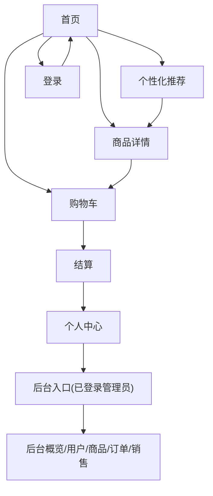

## 1. Product Overview
在不改变核心业务流程（浏览-推荐-加购-下单-订单管理）的前提下，梳理前台页面布局与内容密度，识别“视觉空洞”（信息稀疏、留白失衡、信息层级断裂），并制定可落地的填充方案。
目标：提升页面信息有效密度与信任感；保持视觉风格一致并满足 WCAG 2.1 AA；性能验收明确到可量化指标（首屏渲染延迟 ≤200ms、LCP ≤2.5s、首次互动延迟 ≤50ms）。

## 2. Core Features

### 2.1 User Roles
| 角色 | 注册/登录方式 | 核心权限 |
|------|--------------|----------|
| 游客 | 无需登录 | 浏览首页、搜索、查看商品详情、进入推荐页但需先填写画像 |
| 登录用户 | 手机号/用户名 + 密码登录 | 加入购物车、结算下单、查看/管理订单与地址、提交评价/售后 |
| 管理员 | 后台登录 | 进入后台概览、用户/商品/订单/销售管理 |

### 2.2 Feature Module
本次优化涉及以下核心页面（最小可用集）：
1. **首页**：Hero 区、分类筛选、商品网格、内容填充区（信任/指南/推荐入口）。
2. **商品详情**：商品主信息、购买区、信息补强区（卖点/保障/相关推荐）。
3. **购物车**：空态引导、商品表格、结算摘要、加购后的补强区（凑单/推荐）。
4. **结算**：商品确认、地址填写/选择、支付方式、订单提交。
5. **个性化推荐**：画像表单、推荐列表、可解释理由、状态提示。
6. **登录/注册**：认证表单、错误提示、重定向回跳。
7. **个人中心**：订单/资料/安全/地址的管理与查看。

### 2.3 Page Details
| Page Name | Module Name | Feature description |
|---|---|---|
| 首页 | 密度诊断与填充策略 | 识别 Hero 过高/模块间距过大/商品不足导致的网格空洞；按“先补强信任与导购、再补内容与复购入口”顺序填充。 |
| 首页 | 导购与信任填充区（新增） | 展示 3~4 张信息卡：选购指南入口（跳转推荐页）、服务保障（售后/配送/7天无理由等文案卡）、适配人群/场景标签；均可点击、可键盘聚焦。 |
| 首页 | 商品网格稳态展示（优化） | 当商品不足一屏时自动补齐：显示“热销/新手推荐”占位卡（仍指向现有商品/推荐页）；避免出现大面积空白区域。 |
| 商品详情 | 视觉一致性修复（优化） | 将页面配色与按钮/边框改为使用全局 CSS 变量（--c-*），避免出现与首页不同的灰/蓝体系割裂。 |
| 商品详情 | 信息补强区（新增） | 在描述不足时展示：核心卖点要点列表、适配场景标签、购买须知/售后政策（折叠面板）、同类相关推荐（复用首页列表接口按分类筛选）。 |
| 购物车 | 右侧摘要卡（优化） | 桌面端改为左右布局：左表格、右摘要卡（合计/运费说明/去结算）；减少“表格下方空一大段”的空洞感。 |
| 购物车 | 凑单/推荐区（新增） | 在表格下或右侧摘要卡下方展示 4 个“同类推荐/加购提高适配度”商品卡，复用推荐页/商品列表数据。 |
| 结算 | 信息充实与可理解性（优化） | 商品清单表从仅 ID/数量扩展为：名称、单价、小计（仍来自现有购物车数据）；顶部增加步骤提示（结算-支付-完成）。 |
| 结算 | 地址填写体验（优化） | 默认展示收货地址输入；若已有地址（个人中心维护），提供下拉选择/一键填充；保持键盘可操作与明确 label。 |
| 个性化推荐 | 结果区空态与解释（优化） | 未填写画像时显示引导说明与示例；有结果时显示“筛选摘要”chips（听损等级/预算/场景），强化信息密度。 |
| 登录/注册 | 空洞消减与一致性（优化） | 表单右侧在桌面端展示“为什么需要登录/隐私说明/无障碍提示”信息卡；错误提示用同一告警样式。 |
| 个人中心 | 信息密度提升（新增/优化） | 在顶部增加 3 个概览卡（待支付/售后/默认地址），数据可由现有列表汇总；提供快捷入口到推荐/购物车/地址。 |
| 全局 | 无障碍一致性约束（必须） | 所有新增模块：可 Tab 访问、focus-visible 清晰；交互控件命中区≥48px；图片有 alt；状态更新使用 aria-live；遵守 prefers-reduced-motion；按 WCAG 2.1 AA 做对比度/语义/表单错误提示验收。 |
| 全局 | 性能验收（必须） | 首屏渲染延迟（数据 ready → 首帧完成）≤200ms；LCP ≤2.5s；首次互动延迟（First Input Delay）≤50ms；避免新增模块引入布局抖动（CLS ≤0.1）。 |

## 3. Core Process
- 游客 Flow：进入首页浏览 → 搜索/分类筛选 → 进入商品详情 → 触发加购/结算时提示登录 → 登录后回跳。
- 登录用户 Flow：首页/推荐页选品 → 商品详情加购 → 购物车调整数量 → 结算填写/选择地址与支付方式 → 提交订单 → 个人中心查看订单/支付/售后。
- 管理员 Flow：后台登录 → 概览 → 用户/商品/订单/销售管理。

