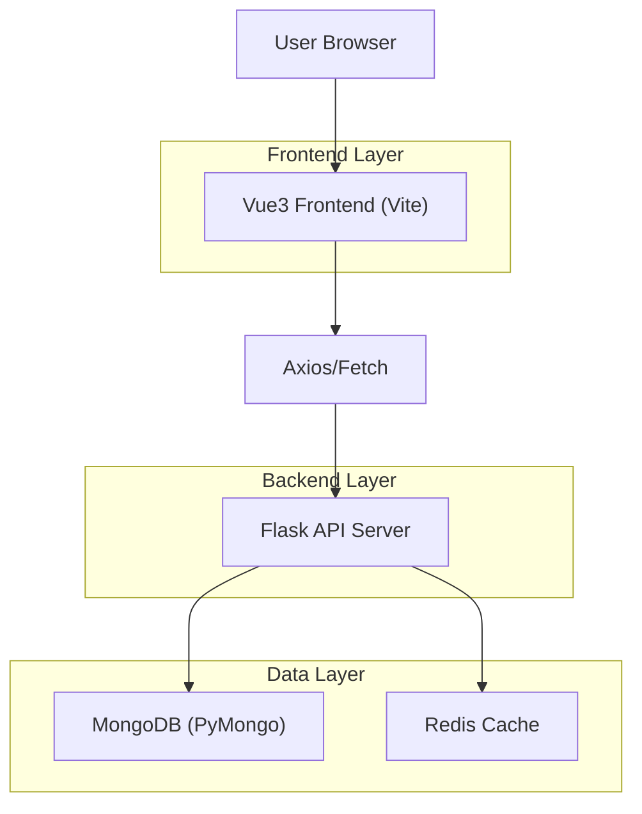
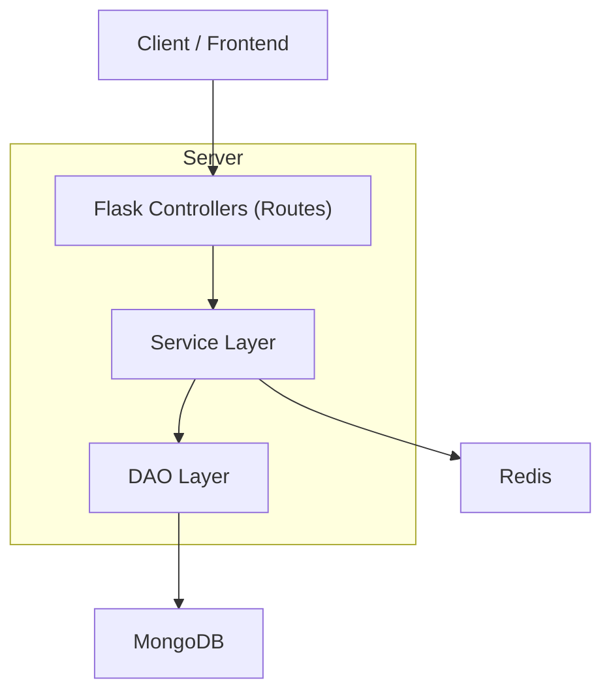
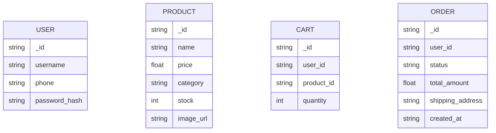

## 1.Architecture design


## 2.Technology Description
- Frontend: Vue@3 + vue-router@4 + pinia@2 + tailwindcss@3 + element-plus@2 + vite
- Backend: Flask@3 + Flask-JWT-Extended + Flask-PyMongo + redis
- Backend (optional capability already present): SSE/streaming（用于商品流式刷新）

## 3.Route definitions
| Route | Purpose |
|---|---|
| / | 首页：分类筛选、商品列表、导购/信任填充区 |
| /product/:id | 商品详情：购买与信息补强 |
| /cart | 购物车：商品管理与结算入口 |
| /checkout | 结算：确认商品、地址、支付、提交订单 |
| /recommendations | 个性化推荐：画像表单+推荐列表 |
| /login | 用户登录（含 redirect 回跳） |
| /register | 用户注册 |
| /profile | 个人中心：订单/安全/地址 |
| /admin/login | 管理员登录 |
| /admin | 管理后台：概览/用户/商品/订单/销售 |

## 4.API definitions
### 4.1 Core API（与页面密度/填充直接相关）
- 商品列表
  - GET /api/product/list
- 商品详情
  - GET /api/product/{id}
- 商品流更新（用于首页“实时刷新”）
  - GET /api/product/stream (SSE)
- 购物车
  - GET /api/cart/items
  - POST /api/cart/add
  - POST /api/cart/update
  - POST /api/cart/remove
- 订单
  - POST /api/order/create
  - GET /api/order/list

建议的前后端共享类型（TypeScript）
```ts
type Product = {
  _id: string
  name: string
  price: number
  image_url?: string
  category?: string
  rating?: number
  stock?: number
  description?: string
}

type CartItem = { product_id: string; quantity: number }

type Order = {
  _id: string
  status: 'pending'|'paid'|'shipped'|'delivered'|'completed'|'cancel_requested'|'cancelled'|'after_sale_pending'|'after_sale_approved'|'after_sale_rejected'
  total_amount: number
  shipping_address: string
  created_at: string
  items: Array<{ product_id: string; name?: string; quantity: number; unit_price: number }>
}
```

## 5.Server architecture diagram


## 6.Data model(if applicable)
### 6.1 Data model definition


## 7. 性能指标（KPI）与验证方法
### 7.1 前端性能指标（桌面端优先）
- Core Web Vitals（真实用户体验/实验室都要看）
  - LCP ≤ 2.5s（首页首屏与推荐页首屏）
  - CLS ≤ 0.1（列表加载/骨架屏切换不抖动）
  - INP ≤ 200ms（分类筛选、加购、切页等交互）
- 资源体积
  - 首屏关键 JS（gzip）≤ 250KB；图片首屏总传输 ≤ 600KB（Hero 背景图需压缩）
- 接口与交互
  - /api/product/list p95 ≤ 300ms；/api/recommendations p95 ≤ 500ms（如存在）
  - 加购/下单关键链路错误率 < 0.5%

### 7.2 验证方法（可操作清单）
- Lighthouse（Chrome DevTools）：分别对 / 与 /recommendations 跑 Performance/A11y，记录 LCP/CLS/INP 与可访问性评分。
- Web Vitals 埋点（前端）：引入 web-vitals（或等价实现）上报 LCP/CLS/INP，到控制台/后端日志；用于对比“填充前后”变化。
- Playwright E2E：在现有 e2e 用例基础上新增/补齐：
  - 首页分类切换/分页/进入详情的性能 trace（关注长任务、网络瀑布）。
  - 键盘 Tab 顺序与焦点可见性回归（确保新增模块不破坏）。
- 性能剖析：Chrome Performance 录制“首页加载+分类切换+加购”三段操作；检查 long task、Layout Shift 来源。
- 后端压测（轻量）：对 /api/product/list 与 /api/order/create 做并发 20~50 的简单压测（如用 pytest/脚本），观察 p95 与错误率。