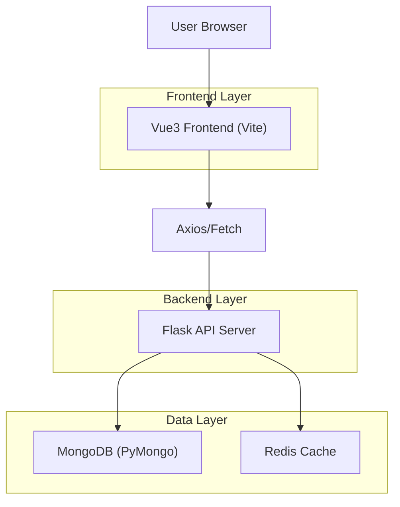
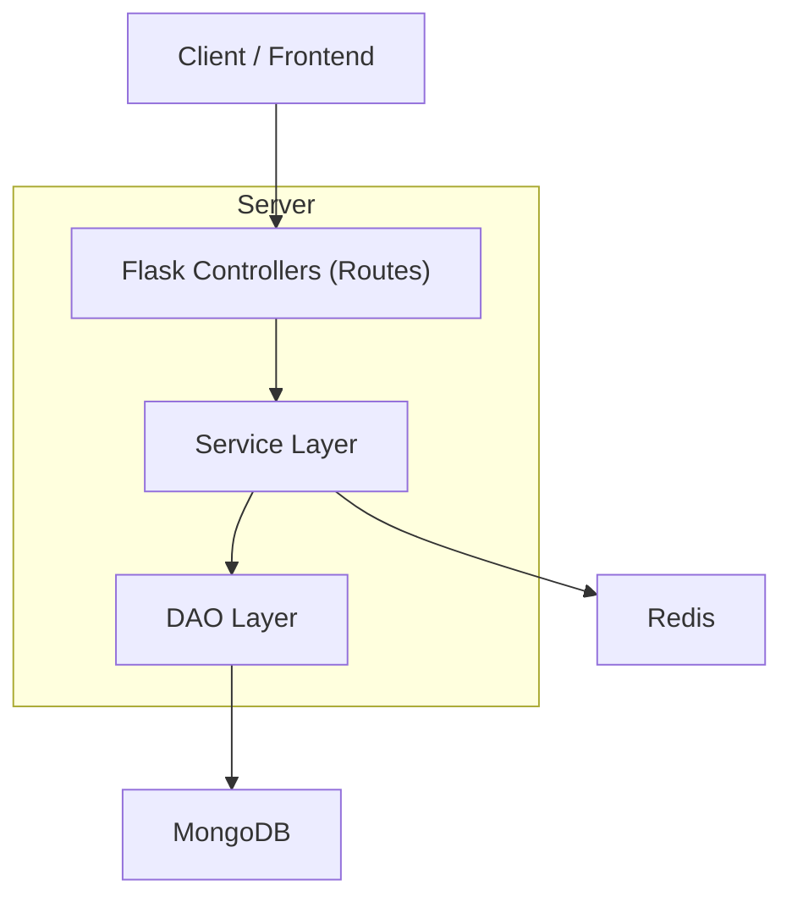
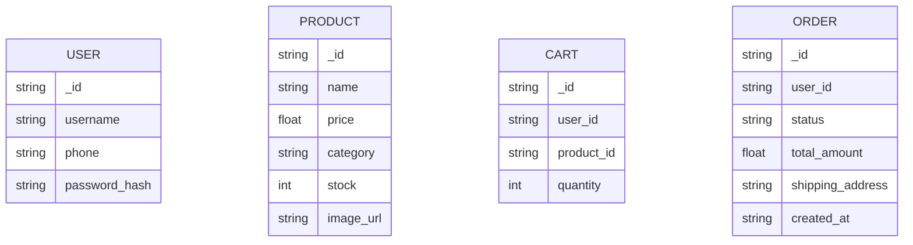

## 1.Architecture design


## 2.Technology Description
- Frontend: Vue@3 + vue-router@4 + pinia@2 + tailwindcss@3 + element-plus@2 + vite
- Backend: Flask@3 + Flask-JWT-Extended + Flask-PyMongo + redis
- Backend (optional capability already present): SSE/streaming（用于商品流式刷新）

## 3.Route definitions
| Route | Purpose |
|---|---|
| / | 首页：分类筛选、商品列表、导购/信任填充区 |
| /product/:id | 商品详情：购买与信息补强 |
| /cart | 购物车：商品管理与结算入口 |
| /checkout | 结算：确认商品、地址、支付、提交订单 |
| /recommendations | 个性化推荐：画像表单+推荐列表 |
| /login | 用户登录（含 redirect 回跳） |
| /register | 用户注册 |
| /profile | 个人中心：订单/安全/地址 |
| /admin/login | 管理员登录 |
| /admin | 管理后台：概览/用户/商品/订单/销售 |

## 4.API definitions
### 4.1 Core API（与页面密度/填充直接相关）
- 商品列表
  - GET /api/product/list
- 商品详情
  - GET /api/product/{id}
- 商品流更新（用于首页“实时刷新”）
  - GET /api/product/stream (SSE)
- 购物车
  - GET /api/cart/items
  - POST /api/cart/add
  - POST /api/cart/update
  - POST /api/cart/remove
- 订单
  - POST /api/order/create
  - GET /api/order/list

建议的前后端共享类型（TypeScript）
```ts
type Product = {
  _id: string
  name: string
  price: number
  image_url?: string
  category?: string
  rating?: number
  stock?: number
  description?: string
}

type CartItem = { product_id: string; quantity: number }

type Order = {
  _id: string
  status: 'pending'|'paid'|'shipped'|'delivered'|'completed'|'cancel_requested'|'cancelled'|'after_sale_pending'|'after_sale_approved'|'after_sale_rejected'
  total_amount: number
  shipping_address: string
  created_at: string
  items: Array<{ product_id: string; name?: string; quantity: number; unit_price: number }>
}
```

## 5.Server architecture diagram


## 6.Data model(if applicable)
### 6.1 Data model definition


## 7. 性能指标（KPI）与验证方法
### 7.1 前端性能指标（桌面端优先，验收以 p75 为准）
- 你指定的验收门槛（必须满足）
  - 首屏渲染延迟 ≤ 200ms：**首屏关键数据 ready（接口返回/缓存命中）→ 首屏关键内容完成首帧绘制** 的 UI 渲染延迟。
  - LCP ≤ 2.5s：覆盖首页与推荐页首屏。
  - 首次互动延迟 ≤ 50ms：以 First Input Delay（FID，首个 pointerdown/keydown）衡量。
- 关联稳定性指标（避免“填充后变卡/变抖”）
  - CLS ≤ 0.1：骨架屏/图片加载/卡片插入不得造成明显抖动。
  - INP ≤ 200ms（建议项）：分类筛选、加购、切页等主要交互。
- 资源体积（建议项）
  - 首屏关键 JS（gzip）≤ 250KB；首屏图片总传输 ≤ 600KB（Hero 与商品图必须压缩且可缓存）。

### 7.2 验证方法（可操作清单）
- Lighthouse（Chrome DevTools）：对 / 与 /recommendations 跑 Performance/A11y，记录 LCP/CLS/INP 与可访问性评分。
- 运行时埋点（项目已具备）：通过 `?perf=1` 启用控制台输出，读取 lcpMs / firstInputDelayMs / cls（见 perfMonitor）。
- 首屏渲染延迟（≤200ms）验证：在“数据 ready”与“首屏关键模块首次绘制”之间打 Performance Mark（或用 rAF + mark），输出 duration 做对比。
- Playwright：新增/补齐首屏加载与点击关键 CTA 的 trace（关注 long task 与主线程阻塞），并做键盘 Tab 顺序与焦点回归。
- 后端轻量压测：对 /api/product/list 与 /api/order/create 做并发 20~50 的简单压测，观察 p95 与错误率。