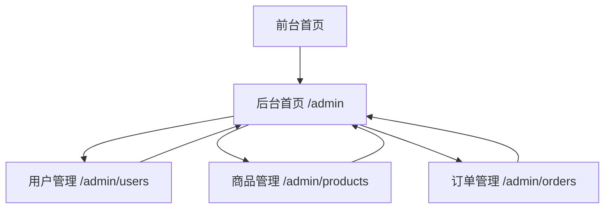

## 1. Product Overview
为现有助听器商城前端新增后台管理模块，支持管理员对用户、商品、订单进行管理。
通过对接现有 `/api/admin` 接口，实现数据查询与管理操作闭环。

## 2. Core Features

### 2.1 User Roles
| 角色 | 注册/获取方式 | 核心权限 |
|------|----------------|----------|
| 普通用户 | 通过 `/api/user/register` 注册并 `/api/user/login` 登录 | 浏览商品、下单、查看个人中心 |
| 管理员 | 由系统初始化或管理员账号登录（用户 `role=admin`） | 访问后台管理；管理用户/商品/订单 |

### 2.2 Feature Module
后台管理需求由以下页面组成：
1. **后台首页**：关键统计数据、快捷入口导航。
2. **用户管理**：用户列表、角色变更（user/admin）。
3. **商品管理**：商品列表、创建商品、编辑商品、删除商品。
4. **订单管理**：订单列表、查看订单明细、修改订单状态。

### 2.3 Page Details
| Page Name | Module Name | Feature description |
|-----------|-------------|---------------------|
| 后台首页 | 数据概览 | 展示用户数/商品数/订单数/累计销售额（对接 `GET /api/admin/stats`） |
| 后台首页 | 导航入口 | 提供到“用户管理/商品管理/订单管理”的可见入口 |
| 用户管理 | 用户列表 | 拉取并展示用户基本信息（对接 `GET /api/admin/users`）；支持刷新 |
| 用户管理 | 角色管理 | 对单个用户修改角色（对接 `PUT /api/admin/users/:user_id/role`），需二次确认 |
| 商品管理 | 商品列表 | 展示商品信息（对接 `GET /api/product/list`）；支持按分类筛选并刷新 |
| 商品管理 | 新增商品 | 表单创建商品（对接 `POST /api/admin/products`）；校验必填字段 |
| 商品管理 | 编辑/删除 | 编辑商品（`PUT /api/admin/products/:product_id`）；删除商品（`DELETE /api/admin/products/:product_id`） |
| 订单管理 | 订单列表 | 拉取并展示订单与用户/金额/状态（对接 `GET /api/admin/orders`）；支持刷新 |
| 订单管理 | 状态流转 | 修改订单状态（对接 `PUT /api/admin/orders/:order_id/status`），限制为后端允许状态集合 |
| 订单管理 | 订单明细 | 查看订单商品项（product_id、数量、单价等），支持展开/弹窗查看 |

## 3. Core Process
**管理员流程**：管理员登录获取 JWT → 进入后台首页查看统计 → 通过侧边导航进入用户/商品/订单管理 → 在列表中执行新增、编辑、删除、状态更新等操作 → 操作成功后提示并刷新列表。

