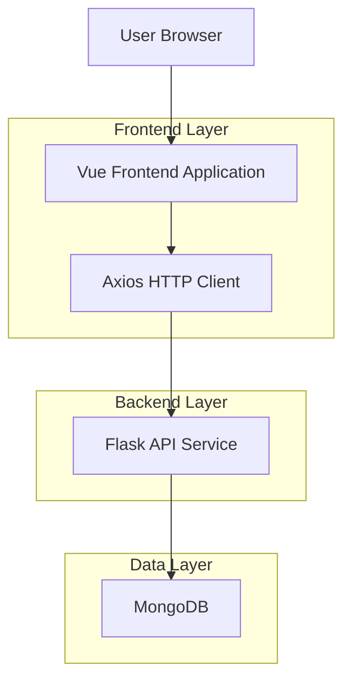
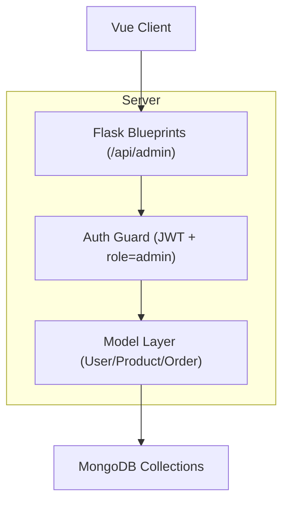

## 1.Architecture design


## 2.Technology Description
- Frontend: Vue@3 + vue-router@4 + pinia@2 + element-plus@2 + axios@1 + tailwindcss@3 + vite@6
- Backend: Flask（现有 REST API）+ flask-jwt-extended（JWT 鉴权）
- Database: MongoDB（通过后端 `mongo` 扩展访问）

## 3.Route definitions
| Route | Purpose |
|-------|---------|
| /admin | 后台首页（统计概览、入口导航） |
| /admin/users | 用户管理（列表、角色修改） |
| /admin/products | 商品管理（列表、新增、编辑、删除） |
| /admin/orders | 订单管理（列表、明细、状态更新） |

## 4.API definitions (If it includes backend services)
> 说明：`/api/admin/*` 接口均要求 `Authorization: Bearer <access_token>`，且当前用户 `role=admin`。

### 4.1 Admin - Stats
`GET /api/admin/stats`

Response（data）：
```ts
type AdminStats = { users: number; products: number; orders: number; total_sales: number }
```

### 4.2 Admin - Users
`GET /api/admin/users`
```ts
type AdminUser = { _id: string; username: string; email: string; role: 'user'|'admin'; created_at?: string }
```

`PUT /api/admin/users/:user_id/role`
Request（body）：
```ts
type SetUserRoleBody = { role: 'user'|'admin' }
```

### 4.3 Admin - Products
`POST /api/admin/products`
`PUT /api/admin/products/:product_id`
`DELETE /api/admin/products/:product_id`

通用商品结构（用于表单/列表）：
```ts
type Product = { _id?: string; name: string; description?: string; price: number; stock: number; category: string; image_url?: string }
```

商品列表（现有接口）：
`GET /api/product/list?category=...`

### 4.4 Admin - Orders
`GET /api/admin/orders`
`PUT /api/admin/orders/:order_id/status`

```ts
type OrderStatus = 'pending'|'paid'|'shipped'|'delivered'|'cancelled'|'completed'

type OrderItem = { product_id?: string; quantity: number; price?: number; name?: string }

type Order = { _id: string; user_id?: string; items: OrderItem[]; total_amount?: number; status: OrderStatus; created_at?: string }
```

## 5.Server architecture diagram (If it includes backend services)


## 6.Data model(if applicable)
- users：_id, username, email, password_hash, role, created_at
- products：_id, name, description, price, stock, category, image_url
- orders：_id, user_id, items[{product_id, quantity, price...}], total_amount, status, created_at