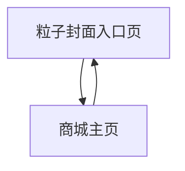

## 1. Product Overview
为商城新增一个“可交互粒子封面入口页”，作为进入主页的第一触点。
它提供跟随/散开/聚合三种粒子交互、明确 CTA 与平滑过渡，并满足 60fps 与首屏 <2s 的性能目标。

## 2. Core Features

### 2.1 User Roles
本需求不区分用户角色（登录与否均可访问入口页）。

### 2.2 Feature Module
本次需求涉及的核心页面如下：
1. **粒子封面入口页**：全屏粒子画面、三种交互模式、进入主页 CTA、加载与性能降级、过渡动效。
2. **商城主页**：从主页可返回入口页、保持导航一致、返回时过渡与状态处理。

### 2.3 Page Details
| Page Name | Module Name | Feature description |
|---|---|---|
| 粒子封面入口页 | 首屏加载 | 显示品牌标题/副标题与粒子画面；在资源未就绪时展示轻量骨架/进度提示；首屏可交互时间目标 <2s。 |
| 粒子封面入口页 | 交互模式切换 | 提供“跟随/散开/聚合”三种模式入口（按钮或分段控件）；切换时平滑过渡（不闪屏、不重置到空白）。 |
| 粒子封面入口页 | 粒子交互（跟随） | 指针/触控移动时，粒子产生吸引/跟随效果；停止移动后逐步回到基态。 |
| 粒子封面入口页 | 粒子交互（散开） | 指针点击/按压或靠近时，粒子以局部半径“受力散开”；结束后缓动回到基态。 |
| 粒子封面入口页 | 粒子交互（聚合） | 触发后粒子向中心或品牌 LOGO 形状聚合；聚合完成后保持稳定或轻微呼吸动画。 |
| 粒子封面入口页 | CTA 进入主页 | 提供主 CTA（例如“进入商城”）；点击后触发页面过渡并进入主页；在过渡期间禁用重复点击并展示反馈。 |
| 粒子封面入口页 | 性能自适应 | 根据设备能力动态调整粒子数量/分辨率/后处理；当帧率持续低于阈值时自动降级并提示（可关闭）。 |
| 粒子封面入口页 | 可访问性与降级 | 支持键盘进入（Tab 聚焦 CTA、Enter 触发）；对“减少动态效果”系统设置进行降级（静态背景/低粒子）。 |
| 商城主页 | 返回入口页 | 在主页显著位置提供“返回封面”入口（如导航/页脚链接）；返回后保持平滑过渡。 |
| 商城主页 | 过渡与状态处理 | 从主页返回入口页时，不强制重新下载资源；按策略保留/重置粒子状态（以体验一致为准）。 |

## 3. Core Process
**用户主流程**
1) 打开网站默认进入“粒子封面入口页”。
2) 用户可移动鼠标/触控体验粒子交互，并可切换模式（跟随/散开/聚合）。
3) 用户点击 CTA“进入商城”，触发平滑过渡并进入“商城主页”。
4) 用户在主页点击“返回封面”，以平滑过渡返回入口页。

