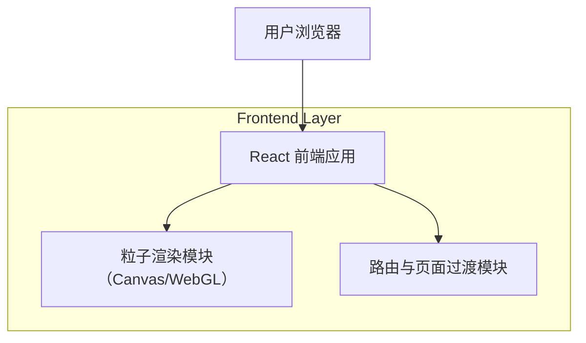

## 1.Architecture design

## 2.Technology Description
- Frontend: React@18 + react-router + Vite
- Rendering: 优先 WebGL（PixiJS 或 Three.js 二选一），不足时回退到 Canvas2D
- Styling: tailwindcss（如项目已统一使用）或现有样式体系
- Backend: None

## 3.Route definitions
| Route | Purpose |
|---|---|
| /cover | 粒子封面入口页：交互模式、CTA、性能自适应 |
| / | 商城主页：可返回入口页，并承接过渡动画 |

## 6.Data model(if applicable)
不涉及数据库与数据模型变更。
